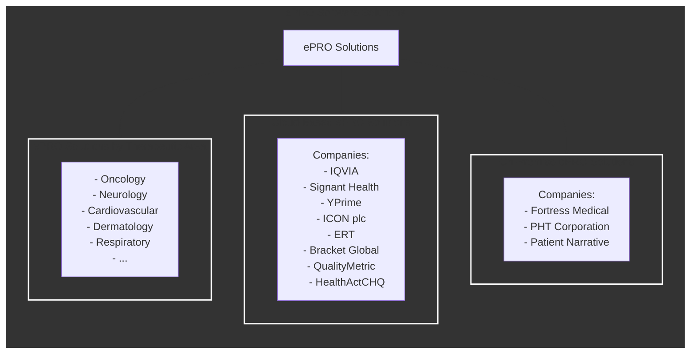

# ePRO-Market-Map

```mermaid
graph TB
    subgraph ePRO [ePRO Software Solutions]
        direction TB
        ePROSolutions[ePRO Solutions]
        
        subgraph CloudBased[Cloud-Based ePRO Solutions]
            CloudCompanies[Companies:<br>- IQVIA<br>- Signant Health<br>- YPrime<br>- ICON plc<br>- ERT<br>- Bracket Global<br>- QualityMetric<br>&nbsp;&nbsp;&nbsp;&nbsp;- HealthActCHQ]
        end

        subgraph OnPremise[On-Premise ePRO Solutions]
            OnPremiseCompanies[Companies:<br>- Fortress Medical<br>- PHT Corporation<br>- Patient Narrative]
        end

        subgraph TherapeuticArea[ePRO Solutions by Therapeutic Area]
            Areas[- Oncology<br>- Neurology<br>- Cardiovascular<br>- Dermatology<br>- Respiratory<br>- ...]
        end

        ePROSolutions --> CloudBased
        ePROSolutions --> OnPremise
        ePROSolutions --> TherapeuticArea
    end

    classDef boxStyle stroke:#ffffff,stroke-width:2px,fill:#333333;
    class ePRO,CloudBased,OnPremise,TherapeuticArea boxStyle;
```
